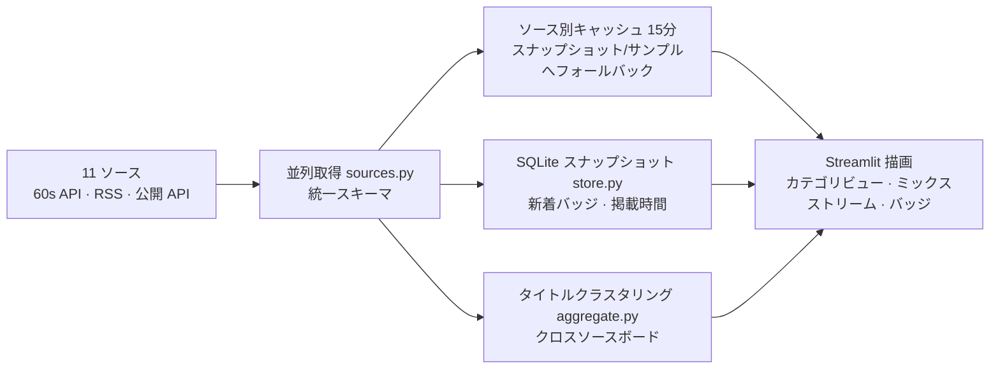

<div align="center">


# 🔥 Hot Search Radar (全网热搜雷达)

**国内の話題 · 世界のニュース · Tech トレンド——11 のライブソースを 1 ページに集約**

[](https://www.python.org)
[](https://streamlit.io)
[](https://baiduhotsearch-d9ysnhxbkzeskrnd5apnn5.streamlit.app/)

**[🌐 ライブダッシュボード (Streamlit Cloud)](https://baiduhotsearch-d9ysnhxbkzeskrnd5apnn5.streamlit.app/)**

[English](./README.md) | [简体中文](./README.zh-CN.md) | **日本語**

*旧「Baidu Hot Search（百度热搜）」——単一ボードのダッシュボードから、マルチソースのトレンドレーダーへ*

</div>

---

## 📸 スクリーンショット

| 🌐 クロスソースボード——同時報道のクラスタリング | 🇨🇳 国内ミックスストリーム——順位でインターリーブ |
|:---:|:---:|
|  |  |

---

## 📖 目次

- [なぜ作ったか](#-なぜ作ったか)
- [特徴](#-特徴)
- [データソース](#-データソース)
- [仕組み](#-仕組み)
- [プロジェクト構成](#-プロジェクト構成)
- [クイックスタート](#-クイックスタート)
- [設定](#️-設定)
- [FAQ](#-faq)
- [ライセンス](#-ライセンス)

## 🎯 なぜ作ったか

1 つのボードに映るのは 1 つのプラットフォームの視点だけ——しかも百度はエンタメ寄り。このプロジェクトは**国内の生活トレンド**（微博 / 知乎 / 抖音 / 今日頭条 / 百度 / ビリビリ）、**中国語の世界ニュース**（Google News / NYT 中文版）、**Tech 界隈**（Hacker News / GitHub Trending / V2EX）を 1 ページに集約し、**複数ソースが同時に報じている**トピックをアルゴリズムでクラスタリングします。独立した複数のランキングが同じ話題で一致したとき、それこそが本当に重要なニュースだからです。

## ✨ 特徴

- 🌐 **クロスソースボード（目玉機能）**：タイトル類似度クラスタリングで、2 つ以上のソースから同一イベントの項目を統合し、ヒット数順にランク付け（同点は統合複合ヒートで比較）——「プラットフォームのノイズ」と「世間全体のニュース」が一目で分かる
- 🗂️ **3 カテゴリビュー**：🇨🇳 国内 / 🌍 国際 / 💻 Tech——単一ソース表示、または全ソースを順位でインターリーブする「ミックスストリーム」
- 🆕 **新着 / 掲載時間バッジ**：SQLite スナップショットで初登場トピックと掲載時間をマーク
- 🛡️ **3 段フォールバックで真っ白にならない**：ライブデータ → 15 分キャッシュ（経過時間表示付き）→ サンプルデータ
- 🩺 **ソース診断パネル**：11 ソースを並列プローブし、可用性・件数・レイテンシをレポート
- ⚖️ **レート制限にやさしい**：ソース別キャッシュ、短命な失敗キャッシュ、リクエストのずらし送り、429 バックオフ
- 🎨 **ダーク「残り火」テーマ**：ガラス風カード、炎グラデーション、TOP-3 メダル、LIVE パルス、ブランドカラーソースバッジ

## 📡 データソース

| カテゴリ | ソース | 取得方式 |
|---|---|---|
| 🇨🇳 国内 | 今日頭条 / 抖音 / ビリビリ | 各社公式 API へ直接（抖音は ttwid 自動登録）、[60s API](https://github.com/vikiboss/60s) フォールバック |
| 🇨🇳 国内 | 微博 | サイドバーに Cookie を貼れば直接接続。未設定時は 60s API 経由 |
| 🇨🇳 国内 | 知乎 | [60s API](https://github.com/vikiboss/60s) アグリゲータ |
| 🇨🇳 国内 | 百度 | top.baidu.com へ直接（プロキシ対応） |
| 🌍 国際 | Google News 中文 / NYT 中文版 | RSS（標準ライブラリのパーサ、依存ゼロ） |
| 💻 Tech | Hacker News | 公式 Algolia API |
| 💻 Tech | GitHub Trending | ページ解析 |
| 💻 Tech | V2EX | 公式オープン API |

> 💡 公開 60s API インスタンスはデータセンター IP（Streamlit Cloud や一部 VPS）に対してレート制限が厳しいため、クラウドデプロイでは知乎 / 60s 日報が取得できない場合があります。今日頭条・抖音・ビリビリ・百度は直接接続のため影響しません。微博はサイドバーに Cookie を貼れば直接接続できます（weibo.com にログイン → F12 → `SUB=...` Cookie をコピー）。国内全ソースを確実に取得したい場合は、60s API をセルフホストしサイドバーから指定してください。

## 🧠 仕組み



## 📁 プロジェクト構成

```
├── app.py          # ページシェル：ビュー遷移、キャッシュ制御、フォールバック、カード
├── sources.py      # ソースレジストリ＆フェッチャ（統一スキーマ、streamlit 非依存）
├── aggregate.py    # クロスソースボード：タイトル正規化 + 類似度クラスタリング
├── store.py        # SQLite 履歴スナップショット（新着 / 掲載時間）
├── styles.py       # テーマ CSS とコンポーネントスタイル
└── logo.svg
```

## 🚀 クイックスタート

```bash
pip install -r requirements.txt
streamlit run app.py
```

## ⚙️ 設定

すべてサイドバーから——コード変更は不要です：

- **60s API インスタンス**：公式 + コミュニティインスタンスを内蔵し自動フェイルオーバー。公開インスタンスはレート制限が厳しいため、[セルフホストインスタンス](https://github.com/vikiboss/60s)（Docker / Node、Vercel / Zeabur へワンクリック）を指定できます
- **微博 Cookie**：1 回貼るだけ（weibo.com にログイン → F12 → 任意のリクエストヘッダから `SUB=...` をコピー）で微博公式 API に直接接続——クラウドデプロイでも動作。未設定時は 60s API 経由
- **プロキシ**：百度ソースは top.baidu.com に直接接続するため、中国本土外からは通常 HTTPS プロキシが必要。「接続テスト / プロキシ自動選択」付き
- **サンプルデータ**：ネットワークなしで UI 全体をプレビュー

## ❓ FAQ

**ソースに「一時的に利用不可」と出る**
公開インスタンスのレート制限か上流の一時的な不調の可能性が高く、5 分以内に自動リトライします。診断パネルを確認するか、セルフホストの 60s API インスタンスに切り替えてください。

**履歴（新着バッジ）は永久に残る？**
Streamlit Cloud は再デプロイ時にファイルシステムを消去するため、履歴は 1 インスタンスの生存期間内でしか蓄積しません。長期保存したい場合は永続ボリューム付きでセルフホストしてください（デフォルトで 7 日間保持）。

**カードにヒート数やバーが表示されないのはなぜ？**
ヒートの単位はプラットフォームごとに異なり、ソース横断で比較すると誤解を招くためです（「1 位のヒートが 2 位より低い」という混乱も発生していました）。そこでボードは順位・ソースヒット数・掲載時間のみを表示します。ヒートは裏側の並び順には使われています：クロスソースボードはヒット数順（同点は複合ヒート）、単一ソースビューは各プラットフォーム固有の順序に従います。

## 👤 作者

**Unlimited Box** · [a18577y@gmail.com](mailto:a18577y@gmail.com)

すべてのデータは各プラットフォームの公開ランキングから取得しており、個人の学習と情報閲覧のみを目的としています。

## 📄 ライセンス

MIT
