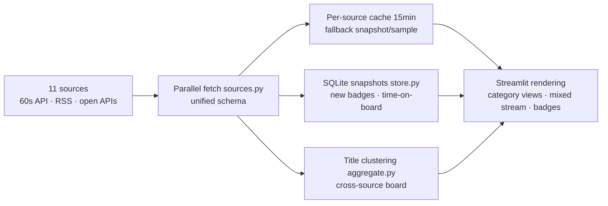

<div align="center">


# 🔥 Hot Search Radar (全网热搜雷达)

**Domestic buzz · World news · Tech trends — 11 live sources aggregated on one page**

[](https://www.python.org)
[](https://streamlit.io)
[](https://baiduhotsearch-d9ysnhxbkzeskrnd5apnn5.streamlit.app/)

**[🌐 Live Dashboard (Streamlit Cloud)](https://baiduhotsearch-d9ysnhxbkzeskrnd5apnn5.streamlit.app/)**

**English** | [简体中文](./README.zh-CN.md) | [日本語](./README.ja-JP.md)

*Formerly "Baidu Hot Search" — a single-board dashboard, now a multi-source trending radar*

</div>

---

## 📸 Screenshots

| 🌐 Cross-source board — same-event clustering | 🇨🇳 Domestic mixed stream — interleaved by rank |
|:---:|:---:|
|  |  |

---

## 📖 Table of Contents

- [Why](#-why)
- [Features](#-features)
- [Data Sources](#-data-sources)
- [How It Works](#-how-it-works)
- [Project Structure](#-project-structure)
- [Quick Start](#-quick-start)
- [Configuration](#️-configuration)
- [FAQ](#-faq)
- [License](#-license)

## 🎯 Why

One board shows you one platform's view — and Baidu's skews entertainment. This project aggregates **domestic life trends** (Weibo / Zhihu / Douyin / Toutiao / Baidu / Bilibili), **world news in Chinese** (Google News / NYT Chinese) and **tech circles** (Hacker News / GitHub Trending / V2EX) onto a single page, then algorithmically clusters topics that **multiple sources are reporting at the same time** — when several independent boards hit the same story, that's the news that actually matters.

## ✨ Features

- 🌐 **Cross-source board (flagship)**: title-similarity clustering merges entries about the same event from ≥2 sources, ranked by hit count (ties by a unified composite heat) — tell "platform noise" from "global news" at a glance
- 🗂️ **Three category views**: 🇨🇳 Domestic / 🌍 World / 💻 Tech — single source, or a "mixed stream" that interleaves all sources by rank
- 🆕 **New / time-on-board badges**: SQLite snapshots mark first-seen topics and how long an entry has been trending
- 🛡️ **Three-tier fallback, never blank**: live data → 15-min cached snapshot (with age notice) → sample data
- 🩺 **Source diagnostics panel**: probes all 11 sources in parallel, reporting availability, item count and latency
- ⚖️ **Rate-limit friendly**: per-source caching, short-lived failure caching, staggered requests and 429 backoff
- 🎨 **Dark "ember" theme**: glassy cards, fire-gradient accents, TOP-3 medals, LIVE pulse, brand-colored source badges

## 📡 Data Sources

| Category | Sources | Access |
|---|---|---|
| 🇨🇳 Domestic | Toutiao / Douyin / Bilibili | First-party APIs direct (Douyin auto-registers ttwid), [60s API](https://github.com/vikiboss/60s) fallback |
| 🇨🇳 Domestic | Weibo | Direct once you paste a Cookie in the sidebar; otherwise via 60s API |
| 🇨🇳 Domestic | Zhihu | [60s API](https://github.com/vikiboss/60s) aggregator |
| 🇨🇳 Domestic | Baidu | Direct top.baidu.com (proxy supported) |
| 🌍 World | Google News 中文 / NYT Chinese | RSS (stdlib parser, zero deps) |
| 💻 Tech | Hacker News | Official Algolia API |
| 💻 Tech | GitHub Trending | Page parsing |
| 💻 Tech | V2EX | Official open API |

> 💡 Public 60s API instances strictly rate-limit datacenter IPs (Streamlit Cloud, some VPS), so Zhihu/60s Daily may stay unavailable on cloud deploys. Toutiao, Douyin, Bilibili and Baidu connect directly and are unaffected. Weibo goes direct once you paste its Cookie in the sidebar (login weibo.com → F12 → copy the `SUB=...` cookie). For full domestic coverage, self-host a 60s API instance and point the sidebar to it.

## 🧠 How It Works



## 📁 Project Structure

```
├── app.py          # Page shell: view nav, cache orchestration, fallbacks, cards
├── sources.py      # Source registry & fetchers (unified schema, streamlit-free)
├── aggregate.py    # Cross-source board: title normalization + similarity clustering
├── store.py        # SQLite history snapshots (new / time-on-board)
├── styles.py       # Theme CSS & component styles
└── logo.svg
```

## 🚀 Quick Start

```bash
pip install -r requirements.txt
streamlit run app.py
```

## ⚙️ Configuration

Everything lives in the sidebar — no code changes needed:

- **60s API instance**: built-in official + community instances with automatic failover; public instances are rate-limited, so you can point to your [self-hosted instance](https://github.com/vikiboss/60s) (Docker / Node, one-click to Vercel / Zeabur)
- **Weibo Cookie**: paste it once (login weibo.com → F12 → copy the `SUB=...` from any request header) to go direct to Weibo's official API — works on cloud deploys too; otherwise via 60s API
- **Proxy**: the Baidu source connects directly to top.baidu.com and usually needs an HTTPS proxy outside mainland China; "Test connection / auto-pick proxy" included
- **Sample data**: preview the full UI with no network

## ❓ FAQ

**A source shows "temporarily unavailable"?**
Usually public-instance rate limiting or an upstream hiccup — it auto-retries within 5 minutes. Check the diagnostics panel, or switch to a self-hosted 60s API instance.

**Is history (new badges) kept forever?**
Streamlit Cloud wipes the filesystem on redeploy, so history only accumulates within one instance's lifetime. Self-host with a persistent volume to keep it long-term (7 days retained by default).

**Why don't cards show heat numbers or bars?**
Heat units differ per platform, and comparing them across sources is misleading (it also caused "rank #1 shows less heat than #2" confusion). Boards therefore show only rank, source hits and time-on-board. Heat still drives ordering behind the scenes: the cross-source board ranks by hit count (ties by composite heat), single-source views follow each platform's own order.

## 👤 Author

**Unlimited Box** · [a18577y@gmail.com](mailto:a18577y@gmail.com)

All data comes from public boards of each platform, for personal learning and information browsing only.

## 📄 License

MIT
