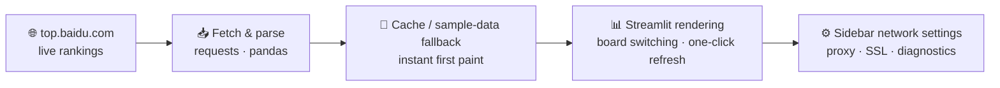

<div align="center">


# 🔥 Baidu Hot Search (中国热搜)

**A real-time Baidu hot-search dashboard built with Streamlit — Overall · Novels · Movies · TV Series, one-click refresh**

[](https://www.python.org)
[](https://streamlit.io)
[](https://baiduhotsearch-d9ysnhxbkzeskrnd5apnn5.streamlit.app/)

**[🌐 Live Dashboard (Streamlit Cloud)](https://baiduhotsearch-d9ysnhxbkzeskrnd5apnn5.streamlit.app/)**

**English** | [简体中文](./README.zh-CN.md)

*Open the page → view the live hot search → switch boards → refresh with one click*

</div>

---

## 📖 Table of Contents

- [Features](#-features)
- [How It Works](#-how-it-works)
- [Usage Guide](#-usage-guide)
- [Project Structure](#-project-structure)
- [Quick Start](#-quick-start)
- [Publishing Online](#-publishing-online)
- [Customization](#-customization)
- [FAQ](#-faq)
- [License](#-license)

## ✨ Features

- 🔥 **Real-time hot search**: pulls the live ranking from top.baidu.com and displays it
- 🗂️ **Board switching**: Overall / Novels / Movies / TV Series
- 🔄 **Fetch latest data**: one-click refresh of the current board
- ⚡ **Instant first paint**: cached or sample data is shown first to avoid a blank wait
- 🧰 **Sidebar settings**: proxy, ignore SSL verification, connection test, one-click diagnose/connect, sample-data toggle
- 🎨 **UI style**: dark "ember" theme — glassy cards, fire-gradient accents, TOP-3 medal badges, heat bars, LIVE pulse, rounded pill components and localized menus

## 🧠 How It Works



1. **Fetch**: `fetch_baidu_board(tab)` pulls the selected board from top.baidu.com and parses it into table data
2. **Fallback**: cached or sample data is rendered first to keep the first paint instant; click "Fetch Latest Data" to switch to real-time data when the network is available
3. **Network settings**: the sidebar supports a proxy (http/https/socks5h), ignoring SSL certificate verification, connection tests, and one-click diagnose/connect
4. **Display**: Streamlit renders the ranking as animated cards (medal badges + heat bars) with Overall / Novels / Movies / TV Series switching and localized menus

## 📖 Usage Guide

- The top of the page shows the current board. The "Fetch Latest Data" button on the right refreshes it immediately.
- Use the board switcher at the top right (Overall / Novels / Movies / TV Series) to view different boards.
- The left sidebar (collapsed by default, click to expand) provides:
  - Enable proxy and fill in a proxy address (http/https/socks5h supported)
  - Ignore SSL certificate verification (needed by some intercepting proxies)
  - Test connection / one-click diagnose / one-click connect (tries to auto-pick a working proxy)
  - Use sample data (view the UI even when the network is unavailable)

## 📁 Project Structure

```text
baiduhotsearch/
├── app.py               # Streamlit main app: board fetching / rendering / sidebar settings / theme injection
├── logo.svg             # Project logo
├── docs/
│   └── index.html       # GitHub Pages redirect page (forwards to Streamlit Cloud)
└── .streamlit/          # Streamlit config (config.toml dark theme)
```

## 🚀 Quick Start

```bash
git clone https://github.com/Mocas-12/baiduhotsearch.git
cd baiduhotsearch
pip install -U streamlit pandas requests
streamlit run app.py
```

> The terminal prints the visit URL (e.g. http://localhost:8501); open it in a browser. Requirements: Python 3.9+ (3.10/3.11 recommended).

| Command | Description |
| --- | --- |
| `pip install -U streamlit pandas requests` | Install dependencies |
| `streamlit run app.py` | Start the app |

## 🌐 Publishing Online

> Note: GitHub Pages only serves static sites and cannot run Python/Streamlit. The recommended approach is "app deployment + Pages presentation".

### Option A: Streamlit Community Cloud (recommended, free)

1. Push this repository to GitHub.
2. Open https://share.streamlit.io/ , connect your GitHub repo, and pick `app.py` as the entry point.
3. After deployment you get a public URL (shaped like `https://<your-app>.streamlit.app`).
4. On GitHub Pages, use a static page to redirect to or embed that URL:
   - Redirect page (recommended, best compatibility): create `docs/index.html` in the repo with the following content, replacing `EXTERNAL_URL` with your online address.

     ```html
     <!doctype html>
     <meta charset="utf-8">
     <meta http-equiv="refresh" content="0; url=EXTERNAL_URL">
     <title>跳转中...</title>
     <a href="EXTERNAL_URL">如果未自动跳转，请点击这里访问应用</a>
     ```

   - Or try an iframe (some hosts may block embedding):

     ```html
     <!doctype html>
     <meta charset="utf-8">
     <style>html,body,iframe{height:100%;width:100%;margin:0;border:0;}</style>
     <iframe src="EXTERNAL_URL"></iframe>
     ```

5. In the GitHub repo settings → Pages, set Source to `Deploy from a branch` and pick the `/docs` directory of the `main` branch.

### Option B: Self-hosted or third-party platforms (Railway/Render/Fly.io/Docker etc.)

1. Deploy on a server or platform:

   ```bash
   pip install -U streamlit pandas requests
   streamlit run app.py --server.address 0.0.0.0 --server.port 80
   ```

   Or with Docker (add your own Dockerfile if desired):

   ```dockerfile
   FROM python:3.11-slim
   WORKDIR /app
   COPY . .
   RUN pip install -U streamlit pandas requests
   EXPOSE 8501
   CMD ["streamlit","run","app.py","--server.address","0.0.0.0","--server.port","8501"]
   ```

2. Once you have a publicly accessible URL, configure the GitHub Pages redirect/embed as described above.

## 🛠️ Customization

- Colors & styles: `apply_theme()` in `app.py` injects CSS/JS — tweak the `--fire1/--fire2` accent variables, shadows, radii, etc.; native widget colors follow `.streamlit/config.toml`.
- Card layout: rank / title / summary / heat are rendered by `render_hot_cards()`; tweak it to show or hide fields (e.g. the summary line).
- Board types: fetched via `fetch_baidu_board(tab)`. Currently mapped to Overall / Novels / Movies / TV Series; add more candidates in `board_map`.

## ❓ FAQ

<details>
<summary><b>Does the first open show real-time data?</b></summary>

- To keep the first screen fast, the app prefers cached or sample data; click "Fetch Latest Data" to switch to real-time data
</details>

<details>
<summary><b>What if the connection fails?</b></summary>

- Check your network; if a proxy is needed, enable it in the sidebar and fill in the address (e.g. `http://127.0.0.1:7890`)
- Try checking "Ignore SSL certificate verification"
- Use "one-click diagnose / one-click connect" to quickly locate a working connection mode
</details>

## 📄 License

- Free for personal/internal use. For public deployments, follow the data source site's usage rules and scraping limits; avoid high-frequency requests.

---

<div align="center">

**Made with 💙**

🌐 [Live Dashboard](https://baiduhotsearch-d9ysnhxbkzeskrnd5apnn5.streamlit.app/) · 🐛 [Report an Issue](https://github.com/Mocas-12/baiduhotsearch/issues)

</div>
