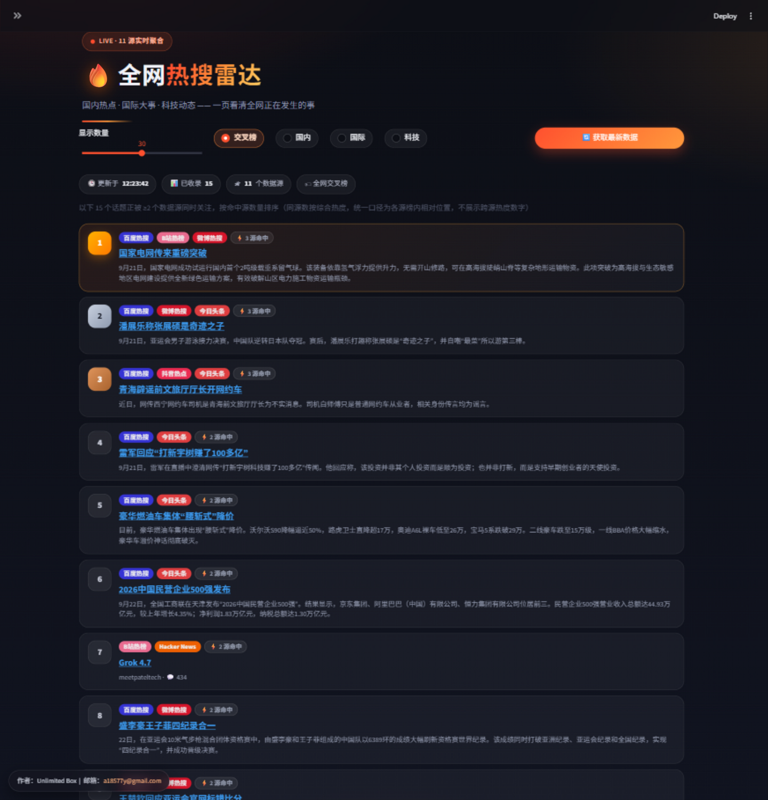
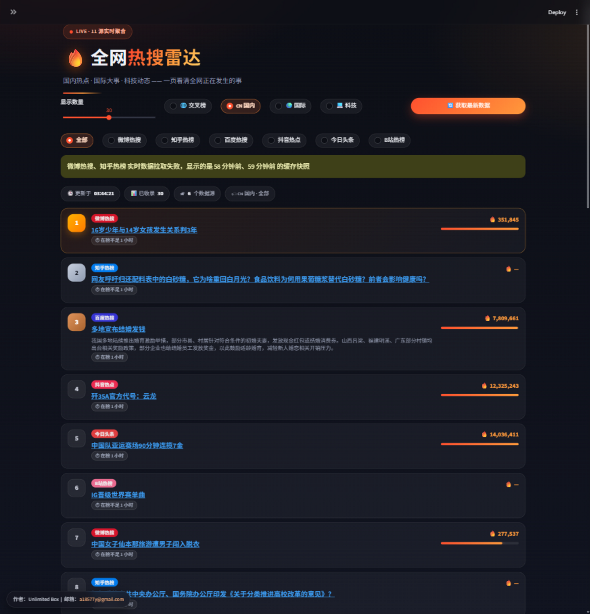
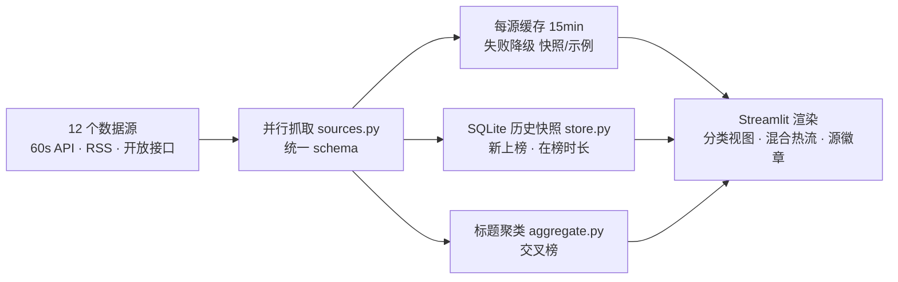

<div align="center">


# 🔥 全网热搜雷达 (Hot Search Radar)

**国内热点 · 国际大事 · 科技动态 —— 12 个数据源实时聚合，一页看清全网正在发生的事**

[](https://www.python.org)
[](https://streamlit.io)
[](https://baiduhotsearch-d9ysnhxbkzeskrnd5apnn5.streamlit.app/)

**[🌐 在线看板（Streamlit Cloud）](https://baiduhotsearch-d9ysnhxbkzeskrnd5apnn5.streamlit.app/)**

*前身「中国热搜（百度）」—— 单一百度榜单的看板已升级为多源聚合雷达*

</div>

---

## 📸 界面预览

| 🌐 交叉榜 —— 多源同热事件聚类置顶 | 🇨🇳 国内 · 混合热流 —— 多源按名次交错 |
|:---:|:---:|
|  |  |

---

## 📖 目录

- [它解决什么问题](#-它解决什么问题)
- [功能特性](#-功能特性)
- [数据源](#-数据源)
- [工作原理](#-工作原理)
- [项目结构](#-项目结构)
- [快速开始](#-快速开始)
- [配置说明](#-配置说明)
- [常见问题](#-常见问题)
- [License](#-license)

## 🎯 它解决什么问题

刷一个榜单只能看到一个平台的热点，而且百度榜单偏娱乐。本项目把**国内生活热点**（微博 / 知乎 / 抖音 / 头条 / 百度 / B站）、**国际新闻**（Google News 中文 / 纽约时报中文网 / 60秒读世界）和**科技圈动态**（Hacker News / GitHub Trending / V2EX）聚合到一个页面，并用算法把「同一件事被多个平台同时关注」的话题识别出来——**多个源同时命中，基本就是当下真正的大事**。

## ✨ 功能特性

- 🌐 **交叉榜（核心亮点）**：标题相似度聚类，把 ≥2 个数据源同时关注的同一事件聚成一簇，按命中源数量与热度排序——一眼分辨「平台小事」和「全网大事」
- 🗂️ **三大分类视图**：🇨🇳 国内 / 🌍 国际 / 💻 科技，支持看单一源或全部源的「混合热流」（按名次轮播交错）
- 🆕 **新上榜 / 在榜时长**：SQLite 记录历史快照，自动标记首次出现的话题与已上榜时长
- 🛡️ **三层降级，永不白屏**：实时数据 → 15 分钟缓存快照（明确提示数据时点）→ 示例数据
- 🩺 **数据源诊断面板**：并行探测全部 12 个源，展示每个源的可用性、条数与耗时
- ⚖️ **限流友好**：每源独立缓存 + 失败短缓存 + 对聚合接口错峰请求与 429 退避
- 🎨 **暗色「余烬」主题**：玻璃卡片、火焰渐变、TOP-3 奖牌徽章、热度条、LIVE 呼吸灯、源品牌色徽章

## 📡 数据源

| 分类 | 数据源 | 接入方式 |
|---|---|---|
| 🇨🇳 国内 | 今日头条 / 抖音热点 / B站热榜 | 直连官方接口（抖音自动注册 ttwid），[60s API](https://github.com/vikiboss/60s) 兜底 |
| 🇨🇳 国内 | 微博热搜 | 侧边栏填入微博 Cookie 后直连；否则走 60s API |
| 🇨🇳 国内 | 知乎热榜 | [60s API](https://github.com/vikiboss/60s) 聚合 |
| 🇨🇳 国内 | 百度热搜 | 直连 top.baidu.com（支持代理） |
| 🌍 国际 | Google News 中文 / 纽约时报中文网 | RSS（标准库解析，零依赖） |
| 🌍 国际 | 60秒读世界 | 60s API |
| 💻 科技 | Hacker News | 官方 Algolia API |
| 💻 科技 | GitHub Trending | 页面解析 |
| 💻 科技 | V2EX 热帖 | 官方开放 API |

> 💡 60s API 公共实例对数据中心 IP（如 Streamlit Cloud、部分 VPS）限制较严，知乎/60秒读世界在云端部署可能持续不可用；头条、抖音、B站、百度均为直连不受影响。微博直连只需在侧边栏粘贴一次 Cookie（登录 weibo.com → F12 → 请求头里的 `SUB=...`）。需要完整国内源时，可自部署 60s API 实例并填入侧边栏。

## 🧠 工作原理



## 📁 项目结构

```
├── app.py          # 页面骨架：视图导航、缓存编排、降级策略、卡片渲染
├── sources.py      # 数据源注册表与抓取器（统一 schema，不依赖 streamlit）
├── aggregate.py    # 跨源交叉榜：标题归一化 + 相似度聚类
├── store.py        # SQLite 历史快照（新上榜 / 在榜时长）
├── styles.py       # 主题 CSS 与组件样式
└── logo.svg
```

## 🚀 快速开始

```bash
pip install -r requirements.txt
streamlit run app.py
```

## ⚙️ 配置说明

全部配置在侧边栏，无需改代码：

- **60s API 实例**：默认使用内置的官方 + 社区实例并自动容灾；公共实例限流较严，可填入[自部署实例](https://github.com/vikiboss/60s)地址（支持 Docker / Node，一键部署到 Vercel / Zeabur）
- **代理**：百度源直连 top.baidu.com，海外网络通常需配置 HTTPS 代理；提供「测试连接 / 一键选代理」
- **示例数据**：断网也可预览完整界面

## ❓ 常见问题

**某个源显示「暂时不可用」？**
多为公共实例限流或上游故障，5 分钟内会自动重试恢复；持续失败可在诊断面板确认，或换自部署 60s API 实例。

**历史数据（新上榜标记）会一直保留吗？**
Streamlit Cloud 的文件系统随应用重建而清空，历史只在本实例生命周期内累积；自部署挂载持久卷可长期保留（默认保留 7 天）。

**热度数字为什么不能跨源比较？**
各平台热度口径不同，热度条只在当前视图内做相对展示；交叉榜的排序依据首先是命中源数量。

## 👤 作者

**Unlimited Box** · [a18577y@gmail.com](mailto:a18577y@gmail.com)

数据均来自各平台公开榜单，仅供个人学习与信息浏览。

## 📄 License

MIT
